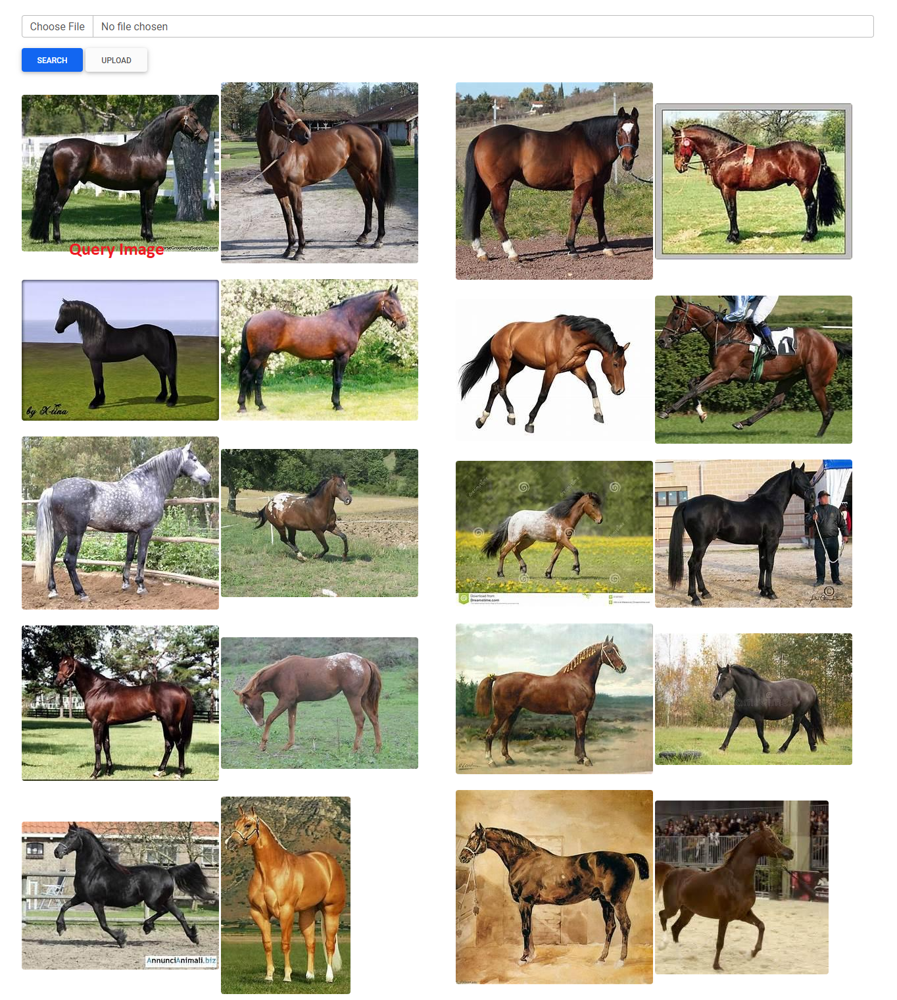

# Simple Content-Based Image Retrieval (Image Search Engine)

Content-based image retrieval is the process of querying by image content. In other words, it uses the relevant features encoded in an image to search retrieve information such as other related images. This project uses the ResNet50 encoder to extract 2048 features from the query image. Then, a crude nearest neighbor search is performed to retrieve more images related to the query image.


## Run Locally

Install dependencies

```bash
  pip3 install -r requirements.txt 
```

Start the server

```bash
  python3 app.py
```

  
## Notes
Be sure to upload some images to the server before searching. The application is meant to query for images of similar content, but if there are no images to query then the search will yield nothing. Here is a dataset that can be fiddled with https://www.kaggle.com/alessiocorrado99/animals10.
## Screenshots



  
